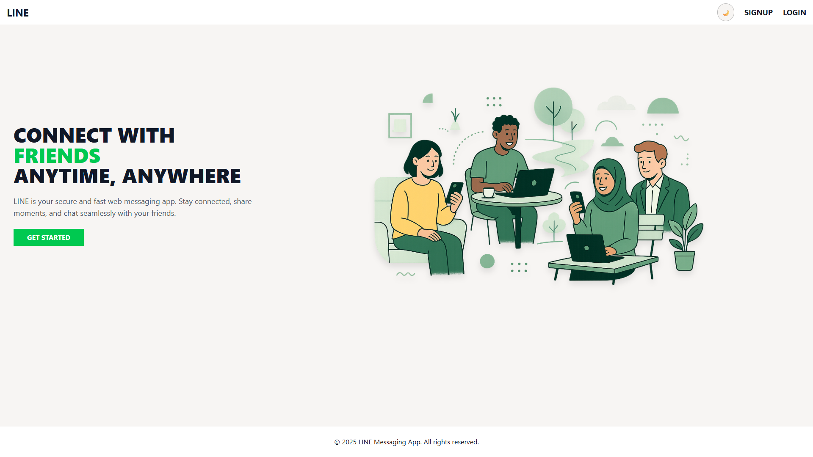
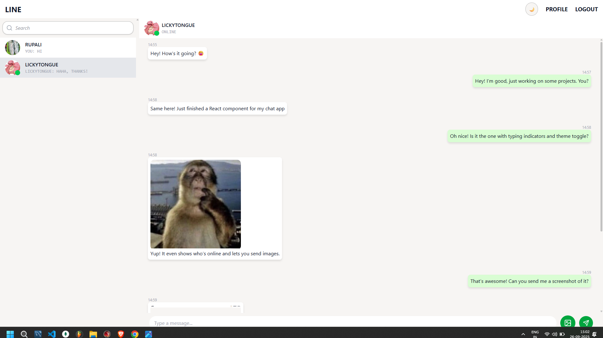
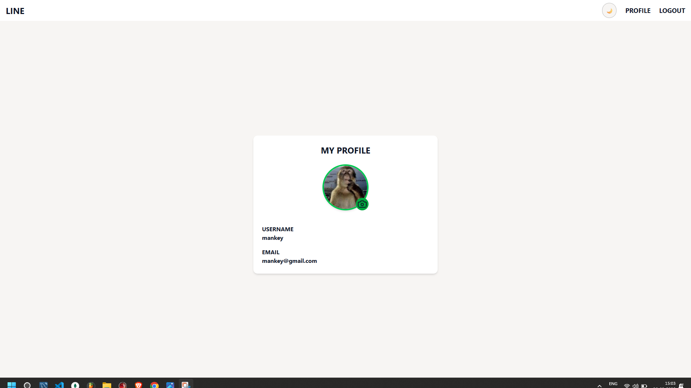

# LINE – Real-Time Messaging App 💬

A **full-stack real-time messaging application** built with the **MERN stack + Socket.IO**, featuring **1:1 chat, image sharing, typing indicators, and more**.  
This project demonstrates my ability to design and implement **scalable, production-ready web applications** with modern technologies.  

---

## 🚀 Features

- **1:1 Chat** – Secure, private conversations  
- **Send Messages & Images** – Rich media support  
- **Typing Indicator** – Real-time feedback for better UX  
- **User Online Indicator** – Know who’s active  
- **Real-Time Messaging** – Powered by WebSockets (Socket.IO)  
- **Theme Toggle** – Light & Dark mode for better accessibility  
- **User Search Bar** – Quickly find and connect with new users  
- **Secure Authentication** – JWT-based login and signup  
- **Easy Logout** – Simple and intuitive session handling  

---

## 📄 Pages

- **Landing Page** – Introduction to the app  
- **Home Page** – Core chat interface  
- **Profile Page** – Manage personal info & avatar  
- **Logout** – One-click session termination  

---

## 🎥 Demo

> Recruiters can instantly see the project in action here 👇  

### 🔗 Live Demo (Optional)
[Deployed App Link](https://linefrontend.vercel.app)  

### 📸 Screenshots
- Landing Page  
    

- Home Page with Real-Time Chat  
    

- Profile Page  
    

---

## 🛠️ Tech Stack

### **Frontend**
- ⚛️ React + React Router DOM (routing)  
- 🗂️ Redux Toolkit (state management)  
- 🔔 React-Toastify (toast notifications)  
- 🔌 Socket.IO client (real-time messaging)  

### **Backend**
- 🟢 Express.js (API & server)  
- 🔌 Socket.IO (real-time communication)  
- 🔐 JSON Web Token (JWT) for authentication  
- 🔒 Bcrypt (password hashing)  
- 📦 Multer (file upload middleware)  
- 🛡️ Express-Validator (data validation)  
- 🍪 Cookie-Parser (session handling)  
- 🌍 CORS (cross-origin support)  
- 🔑 UUID (unique file identifiers)  
- ⚙️ Dotenv (environment variables)  

### **Database & Storage**
- 🗄️ MongoDB Atlas (user data storage)  
- 🪣 Supabase Storage (user avatars & images)  
- 🔗 Mongoose (ODM for MongoDB)  
